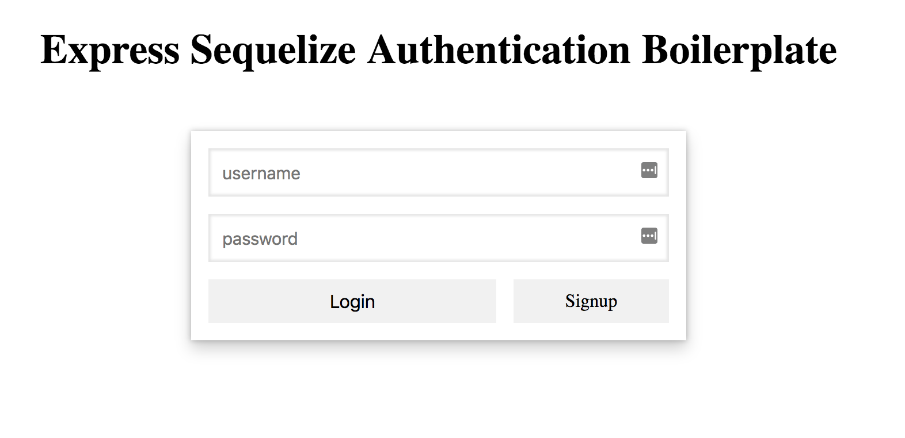
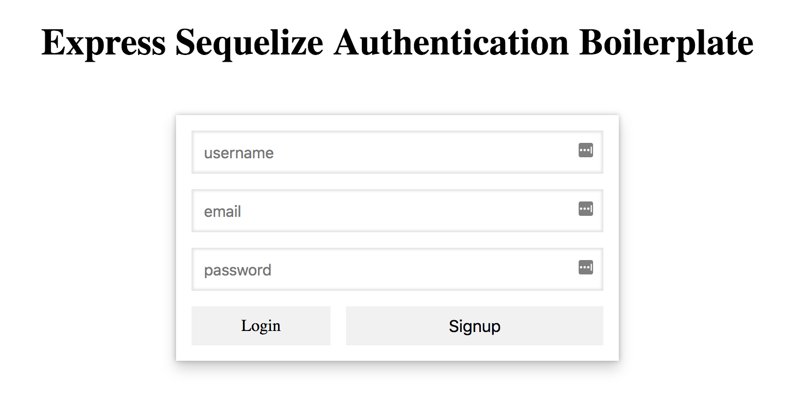
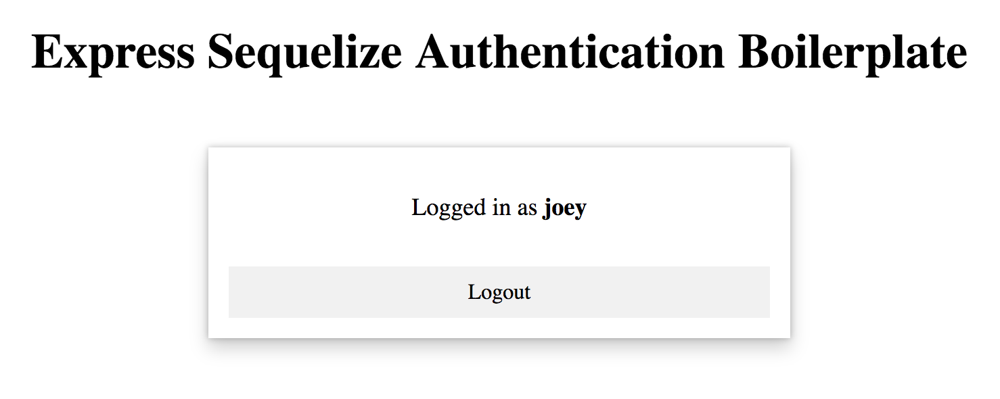

# Express Sequelize Authentication Boilerplate

To get started

- you must have yarn, mysql, and node installed
- create local db named custom_auth_tutorial
- yarn install
- yarn start

Recommended Installations

 - nodemon
 - mySQL Workbench
 - postman

Inspired by my medium post here:
https://medium.com/@jgrisafe/custom-user-authentication-with-express-sequelize-and-bcrypt-667c4c0edef5

# Screen Shots

## login page

## register page

## logged-in view
